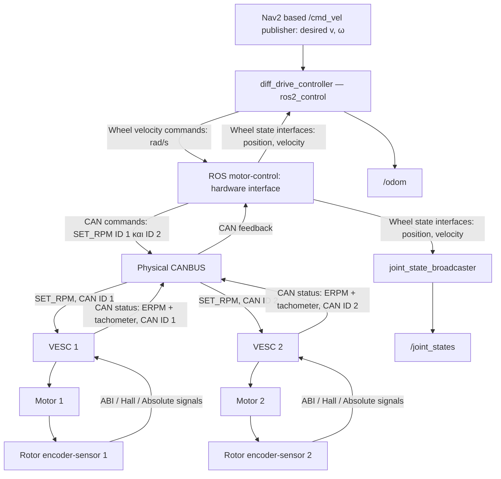
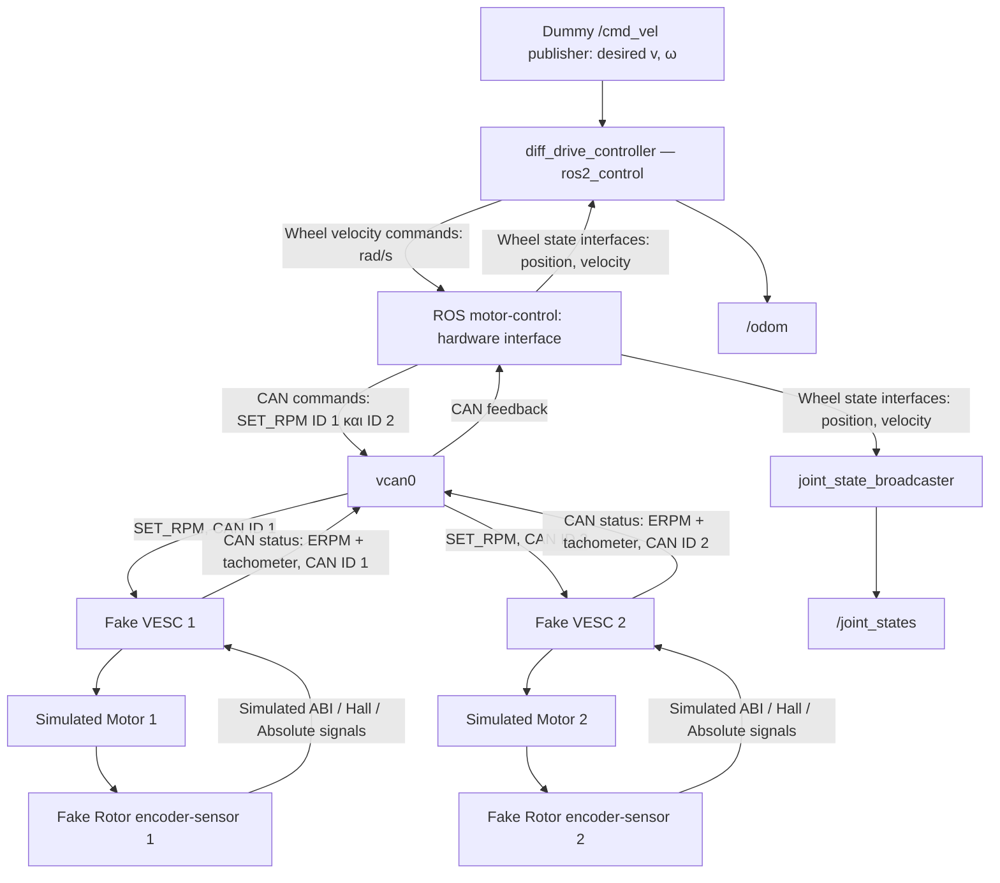
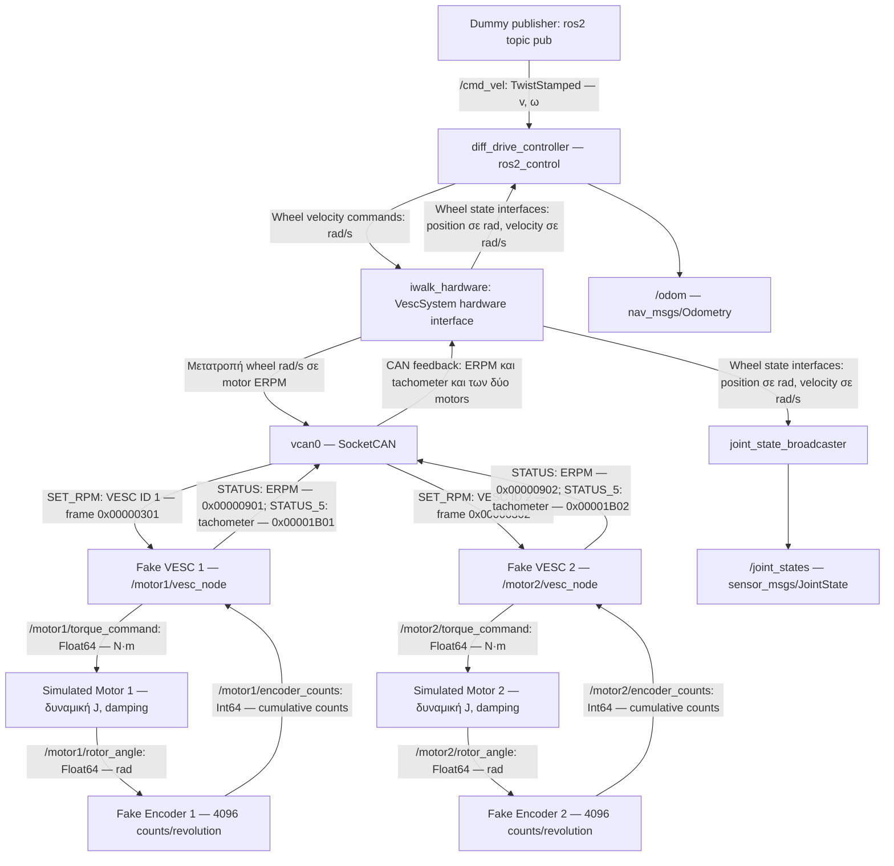

# VIRTUAL MOTOR-ENCODER DEVELOPMENT USING CANBUS AND VESC

We isolate the development of iwalk-motor controllers. To do that we use the flow presented bellow.

We want the real system to work like this:
-----------------



In order to develop it we work as follows:

-----------------



| Package | Υλοποίηση | Περιγραφή |
| --- | --- | --- |
| `iwalk_hardware` | C++ plugin του `ros2_control` | Hardware interface και επικοινωνία CAN |
| `iwalk_fake_vesc` | Python node, δύο instances | **V1, V2**: δύο ξεχωριστά instances fake VESC |
| `iwalk_sim_motor` | Python node, δύο instances | **M1, M2**: δύο ξεχωριστά instances κινητήρα |
| `iwalk_fake_encoder` | Python node, δύο instances | **B**: Γεωμετρία, joints και meshes |
| `iwalk_bringup` | Python package για launch, config και dummy publisher | Launch, παραμετροποίηση και dummy `/cmd_vel` publisher |


## **TUTORIAL**

## Motors and Encoders

### STEP 1 - Build
```bash
colcon build --symlink-install   --packages-select iwalk_sim_motor iwalk_fake_encoder
```

### STEP 2 - Δοκιμή Motor-Encoder
Σε 4 terminals

Σε καθένα τρέξε:

```bash
source ~/iwalk_motor_ws/install/setup.bash
```

Terminal 1 — κινητήρας:

```bash

ros2 run iwalk_sim_motor motor_node --ros-args -r __ns:=/motor1
```
Terminal 2 — encoder:
```bash

ros2 run iwalk_fake_encoder encoder_node --ros-args -r __ns:=/motor1
```
Terminal 3 — εντολή ροπής:
```bash

ros2 topic pub --rate 20 /motor1/torque_command \
  std_msgs/msg/Float64 "{data: 0.1}"
```
Terminal 4 — εμφάνιση counts:
```bash

ros2 topic echo /motor1/encoder_counts
```

## Virtual canbus
### STEP 1 - Δημιουργία virtual can
```bash
sudo modprobe vcan

if ! ip link show vcan0 >/dev/null 2>&1; then
  sudo ip link add dev vcan0 type vcan
fi

sudo ip link set dev vcan0 up

ip -details link show vcan0
```
### STEP 2 - Δοκιμή virtual can
Θα χρειαστούμε 2 terminal

Terminal 1:
```bash
candump vcan0
```
Terminal 2:
```bash
cansend vcan0 123#01020304
```
Στο πρώτο πρέπει να εμφανιστεί κάτι σαν:
```bash
vcan0  123   [4]  01 02 03 04
```
## Fake VESC

### Δοκιμή fake VESC
```bash
sudo apt install python3-can

cd ~/iwalk_motor_ws
colcon build --symlink-install --packages-select iwalk_fake_vesc
source install/setup.bash

ros2 pkg executables iwalk_fake_vesc
```
Πρέπει να εμφανιστεί:
```bash
iwalk_fake_vesc vesc_node
```

### Δοκιμή Motor-encode-vesc-vcan

Θα χρειαστούμε 6 terminals


Terminal 1 — motor:
```bash
ros2 run iwalk_sim_motor motor_node --ros-args -r __ns:=/motor1
```

Terminal 2 — encoder:
```bash
ros2 run iwalk_fake_encoder encoder_node --ros-args -r __ns:=/motor1
```
Terminal 3 — fake VESC:
```bash
ros2 run iwalk_fake_vesc vesc_node --ros-args \
  -r __ns:=/motor1 \
  -p vesc_id:=1 \
  -p pole_pairs:=7
```
Terminal 4 — επαναλαμβανόμενη εντολή 300 ERPM, κάθε 50 ms:
```bash
while true; do
  cansend vcan0 00000301#0000012C
  sleep 0.05
done
```
Terminal 5 — παρακολούθηση της εκτιμώμενης μηχανικής ταχύτητας:
```bash
ros2 topic echo /motor1/vesc_estimated_velocity
```
Περιμένουμε τιμές κοντά στα 4.49 rad/s:

$$ \omega=\frac{300}{7}\frac{2\pi}{60}\approx4.488\ \mathrm{rad/s} $$

Terminal 6 — παρακολούθηση CAN commands και feedback:
```bash
candump vcan0
```
Πρέπει να εμφανίζονται:

Ενδεικτική έξοδος
```bash
vcan0  00000301   [4]  00 00 01 2C
vcan0  00000901   [8]  00 00 01 2C 00 00 00 00
vcan0  00001B01   [8]  00 00 00 64 00 F0 00 00
```


## Μέχρι στιγμής υλοποίηση:


## Testing της μέχρι τώρα υλοποίησης

Η δοκιμή ελέγχει ολόκληρη την αλυσίδα: από την εντολή `/cmd_vel`, μέσω του `diff_drive_controller` και του hardware interface, μέχρι τους δύο simulated motors και την επιστροφή feedback στα `/joint_states` και `/odom`.

### STEP 1 — Προετοιμασία

Σταματάμε με `Ctrl+C` τα nodes και τους publishers των προηγούμενων μεμονωμένων δοκιμών, καθώς και τα loops με `cansend`. Το launch θα ξεκινήσει και τα δύο σύνολα motor–encoder–VESC.

Build:

```bash
source /opt/ros/jazzy/setup.bash
cd ~/iwalk_motor_ws
colcon build --symlink-install
source install/setup.bash
```

Δημιουργία και ενεργοποίηση του `vcan0`:

```bash
sudo modprobe vcan

if ! ip link show vcan0 >/dev/null 2>&1; then
  sudo ip link add dev vcan0 type vcan
fi

sudo ip link set dev vcan0 up
```

### STEP 2 — Εκκίνηση του συστήματος

Χρησιμοποιούμε 5 terminals. Σε καθένα εκτελούμε πρώτα:

```bash
source /opt/ros/jazzy/setup.bash
source ~/iwalk_motor_ws/install/setup.bash
```

**Terminal 1 — Launch:**

```bash
ros2 launch iwalk_bringup fake_control.launch.py
```

Το launch ξεκινά:

- Δύο simulated motors.
- Δύο fake encoders.
- Δύο fake VESC με IDs 1 και 2.
- Το `robot_state_publisher`.
- Το `ros2_control_node`, που φορτώνει το hardware interface.
- Τους `diff_drive_controller` και `joint_state_broadcaster`.

### STEP 3 — Έλεγχος ενεργοποίησης

**Terminal 2:**

```bash
ros2 control list_controllers
ros2 control list_hardware_interfaces
```

Αναμένουμε και τους δύο controllers σε κατάσταση `active`:

```text
joint_state_broadcaster joint_state_broadcaster/JointStateBroadcaster active
diff_drive_controller   diff_drive_controller/DiffDriveController     active
```

Τα command interfaces των τροχών πρέπει να είναι διαθέσιμα και δεσμευμένα:

```text
left_rear_wheel_joint/velocity [available] [claimed]
right_rear_wheel_joint/velocity [available] [claimed]
```

Πρέπει επίσης να εμφανίζονται τα state interfaces:

```text
left_rear_wheel_joint/position
left_rear_wheel_joint/velocity
right_rear_wheel_joint/position
right_rear_wheel_joint/velocity
```

### STEP 4 — Εντολή ευθύγραμμης κίνησης

**Terminal 2 — Dummy publisher, 20 Hz:**

```bash
ros2 topic pub --rate 20 /cmd_vel geometry_msgs/msg/TwistStamped \
  "{header: auto, twist: {linear: {x: 0.1}, angular: {z: 0.0}}}"
```

Η εντολή ζητά γραμμική ταχύτητα `0.1 m/s` και μηδενική γωνιακή ταχύτητα.

Για ακτίνα τροχού `0.095 m`, η αναμενόμενη ταχύτητα κάθε τροχού είναι:

```text
ω_wheel = v / r = 0.1 / 0.095 ≈ 1.053 rad/s
```

### STEP 5 — Παρακολούθηση feedback

**Terminal 3 — Joint states:**

```bash
ros2 topic echo /joint_states
```

Αναμένουμε:

- Τα δύο rear wheel joints στο πεδίο `name`.
- Θετικές, περίπου ίσες ταχύτητες κοντά στα `1.053 rad/s`, μετά το αρχικό μεταβατικό.
- Θέσεις σε rad που αυξάνονται με την κίνηση.

Το `effort: .nan` είναι αναμενόμενο, επειδή δεν παρέχουμε effort state interface.

**Terminal 4 — Odometry:**

```bash
ros2 topic echo /odom
```

Αναμένουμε:

- Αύξηση της θέσης `pose.pose.position.x`.
- Μικρή μεταβολή της θέσης `y` και του προσανατολισμού για ευθύγραμμη κίνηση.
- Μέση γραμμική ταχύτητα κοντά στα `0.1 m/s`.
- Γωνιακή ταχύτητα κοντά στο μηδέν.

Η οδομετρία υπολογίζεται από το feedback θέσης των τροχών. Η κβάντιση του tachometer μπορεί να προκαλεί διακυμάνσεις στη στιγμιαία ταχύτητα.

**Terminal 5 — CAN traffic:**

```bash
candump vcan0
```

Αναμένουμε extended CAN frames και για τα δύο VESC:

| Frame ID | Περιεχόμενο |
| --- | --- |
| `00000301` | SET_RPM προς VESC 1 |
| `00000302` | SET_RPM προς VESC 2 |
| `00000901` | STATUS από VESC 1, με ERPM |
| `00000902` | STATUS από VESC 2, με ERPM |
| `00001B01` | STATUS_5 από VESC 1, με tachometer |
| `00001B02` | STATUS_5 από VESC 2, με tachometer |

### STEP 6 — Έλεγχος διακοπής εντολών

Σταματάμε μόνο τον publisher στο Terminal 2 με `Ctrl+C`, αφήνοντας το launch και την παρακολούθηση ενεργά.

Μετά το configured command timeout (`0.5 s`), αναμένουμε:

- Οι ταχύτητες των τροχών να τείνουν στο μηδέν κατά την επιβράδυνση.
- Οι θέσεις των τροχών και η οδομετρία να σταθεροποιηθούν.
- Το feedback να συνεχίσει να δημοσιεύεται.

### Τρέχον αποτέλεσμα και εκκρεμότητες

Έχουν παρατηρηθεί επιτυχώς:

- Ενεργοποίηση και των δύο controllers.
- Δέσμευση των wheel command interfaces.
- Κίνηση των δύο simulated motors μέσω `/cmd_vel`.
- Δημοσίευση wheel states και οδομετρίας.

Απομένει η επαλήθευση της διακοπής εντολών, της όπισθεν, της στροφής, της απώλειας feedback και της ακρίβειας της οδομετρίας.

Οι encoders επιστρέφουν προς το παρόν cumulative counts. Η υποστήριξη ABI / Hall / Absolute παραμένει μελλοντική επέκταση.

Το `/odom` δημοσιεύεται ως topic. Η δημοσίευση του odometry TF παραμένει απενεργοποιημένη στην τωρινή παραμετροποίηση.
