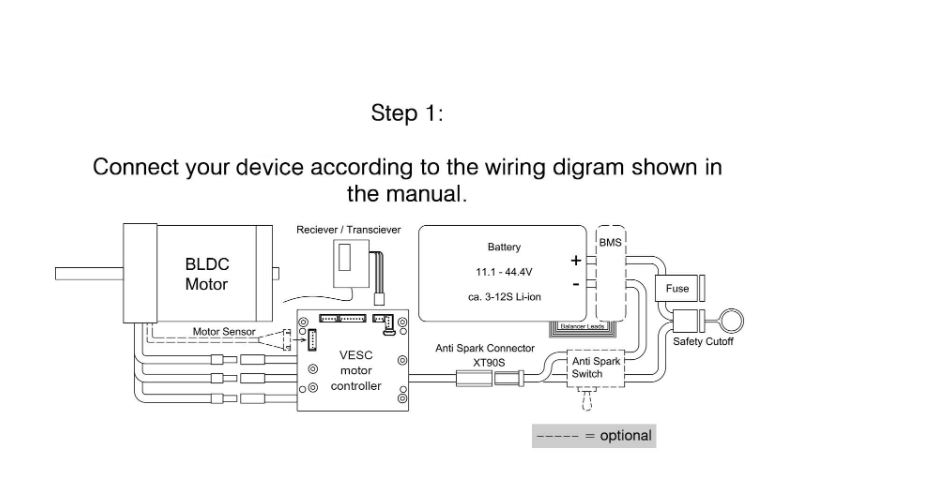

VESC LINKS

[text](<../meeting_notes (1).md>)
https://vesc-project.com/node/178

A complete reference schematic and layout with two shunt resistors
https://github.com/vedderb/bldc-hardware


Useful youtube channel
https://www.youtube.com/@BenjaminsRobotics/videos


## Battery stuff
Continuous discharge rating specs μπαταρίας (Safely I(A))
cells specs->battery specs
In dual motor configuration


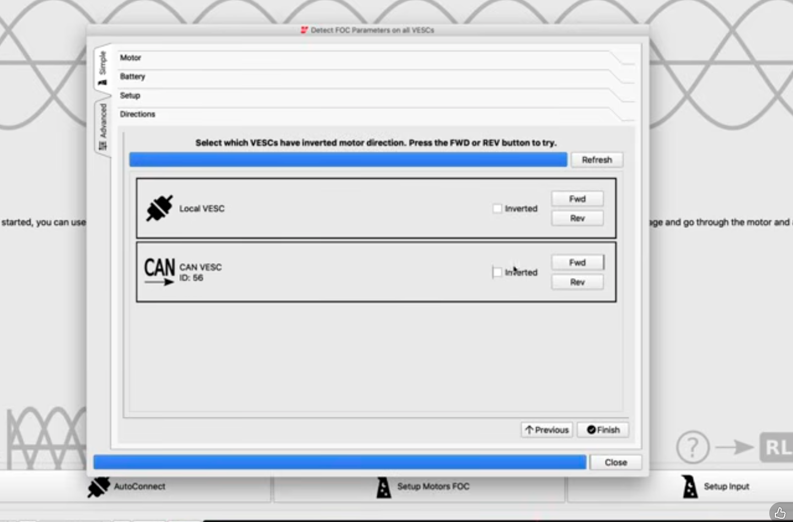


### VescCan Documentation
https://github.com/vedderb/bldc/blob/master/documentation/comm_can.md?utm_source=chatgpt.com

Το CAN μεταφέρει μικρά VESC commands όπως:

CAN_PACKET_SET_RPM
CAN_PACKET_SET_CURRENT
CAN_PACKET_SET_POS

Στο VESC Tool υπάρχουν δύο μεγάλες κατηγορίες:

**Motor Settings**

Αφορούν:

Motor type.
FOC parameters.
Motor current limits.
ERPM limits.
Encoder/Hall settings.
Temperature limits.


**App Settings**

Αφορούν το πώς λαμβάνει εντολές ο VESC:

PPM.
ADC throttle.
UART.
CAN.
NRF/remote.
Communication timeout.
VESC CAN ID.
CAN status-message rates.


### NVidia Can
https://docs.nvidia.com/jetson/archives/r36.4.3/DeveloperGuide/HR/ControllerAreaNetworkCan.html?utm_source=chatgpt.com

Όμως εξακολουθεί να χρειάζεται ένας πραγματικός CAN transceiver ανάμεσα στον CAN controller του Jetson και στα καλώδια CAN-H/CAN-L.

Ο CAN controller παράγει ψηφιακά σήματα CAN_TX και CAN_RX. Ο transceiver τα μετατρέπει στα διαφορικά ηλεκτρικά σήματα CAN-H και CAN-L.

### CAN
Το CAN — Controller Area Network — είναι ένας ανθεκτικός, real-time-oriented σειριακός δίαυλος επικοινωνίας.

Χρησιμοποιεί δύο διαφορικά καλώδια:

CAN-H
CAN-L

Επειδή η πληροφορία προκύπτει κυρίως από τη διαφορά τάσης μεταξύ τους, έχει καλή αντοχή στον ηλεκτρικό θόρυβο των motors και των power electronics.


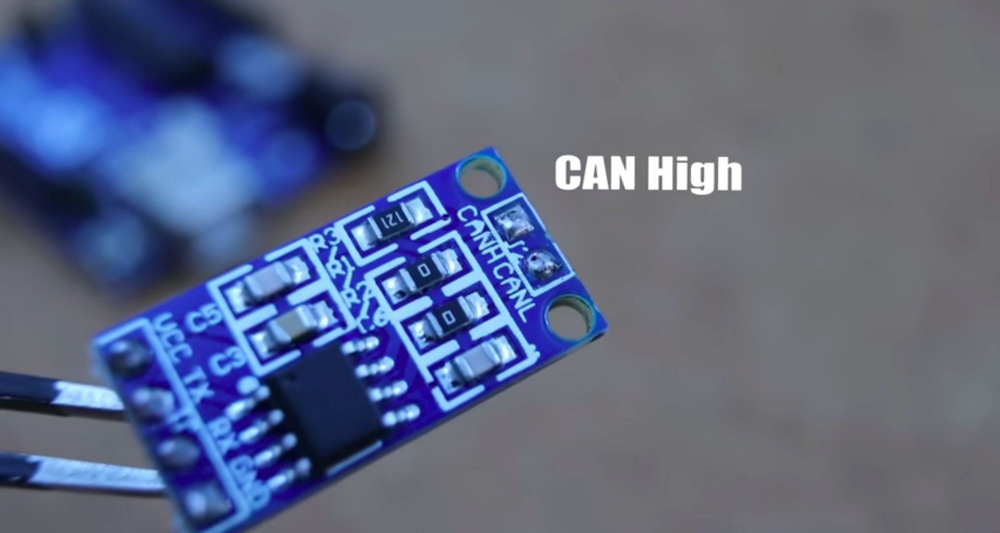 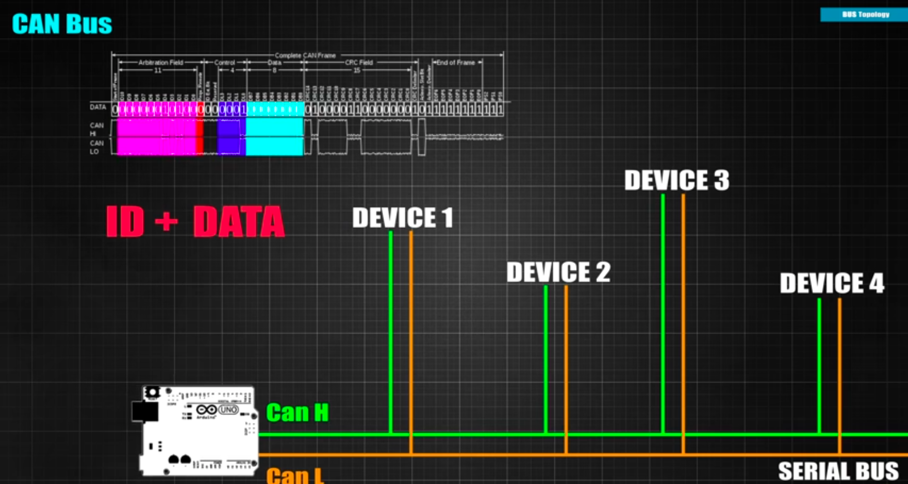 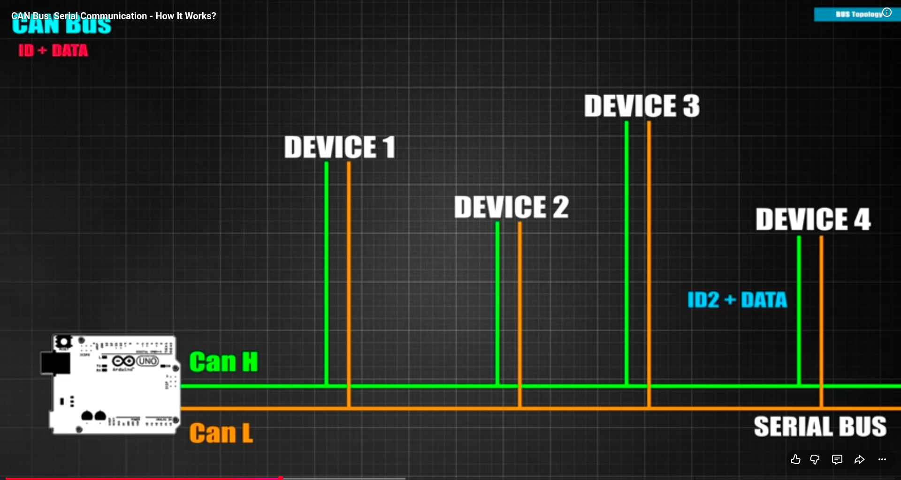 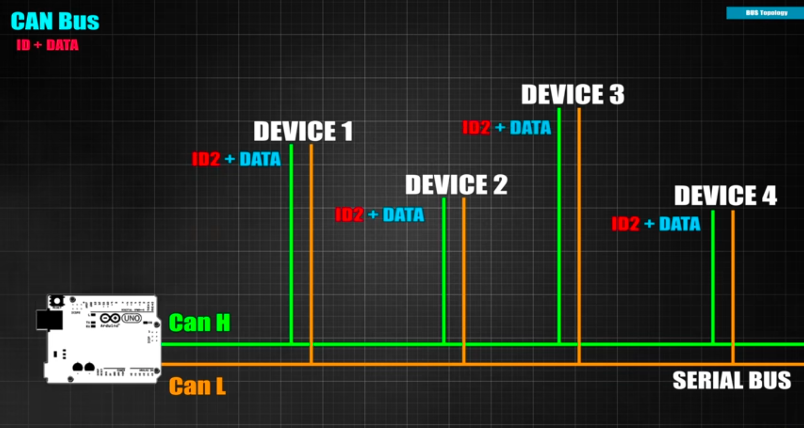 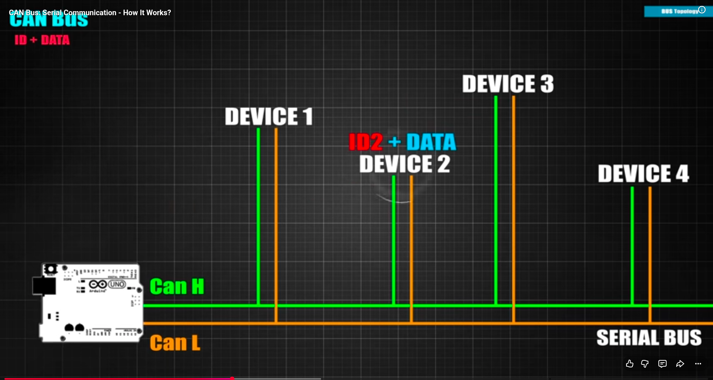 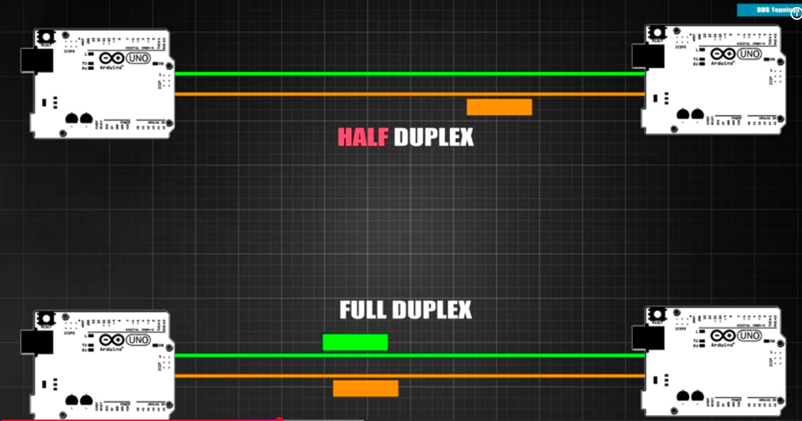 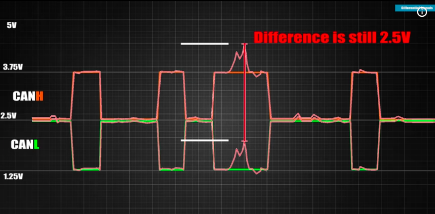

**Data**
Start bit 0 to know a new message starts

D0-D10 -> device identifier

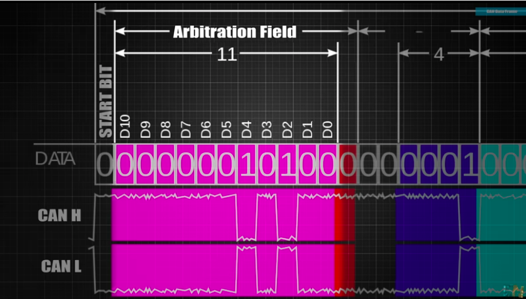
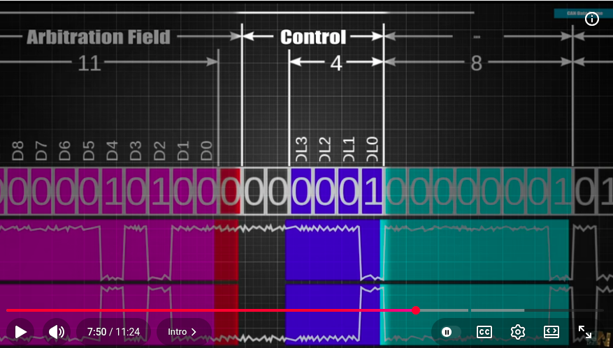
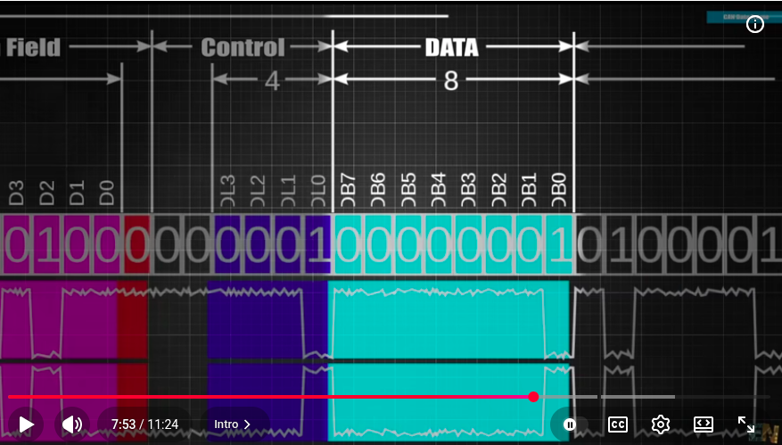

The CRC checks errors in message
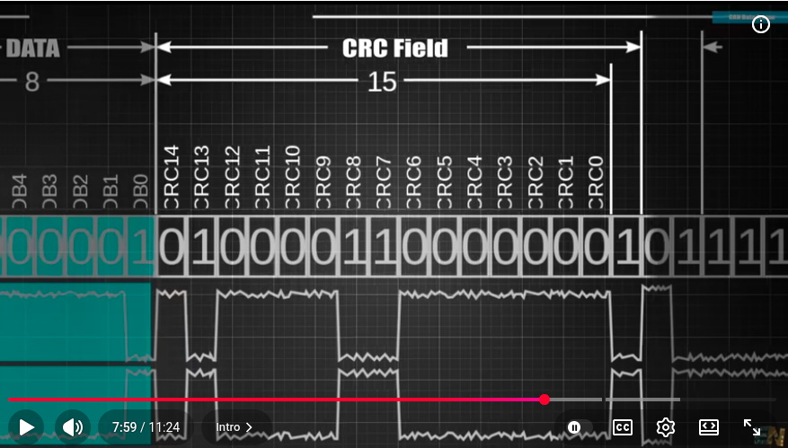
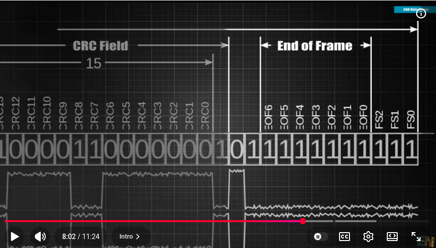


Δεν χρειάζεται ξεχωριστή CAN σύνδεση Jetson–VESC για κάθε motor. Τα VESC ξεχωρίζουν μέσω CAN IDs:

Left VESC: ID 1
Right VESC: ID 2

Οι πραγματικές τιμές των IDs μπορούν να είναι διαφορετικές, αρκεί να είναι μοναδικές.

**Τερματισμός**

Στα δύο φυσικά άκρα του bus χρειάζονται συνήθως:

$$ 120\,\Omega $$

μεταξύ CAN-H και CAN-L.

Με κλειστή τροφοδοσία, αν υπάρχουν δύο σωστές αντιστάσεις \(120\,\Omega\), το πολύμετρο συνήθως μετρά περίπου:

$$ 120\parallel120=60\,\Omega $$

Μην τοποθετήσεις 120 Ω σε κάθε συσκευή. Μόνο στα δύο άκρα του bus.

**Καλωδίωση**


Χρησιμοποίησε:

Συνεστραμμένο ζεύγος για CAN-H και CAN-L.
Όσο γίνεται γραμμική τοπολογία.
Μικρά branches/stubs.
Κοινό reference ground όταν το απαιτεί η διάταξη.
Επιβεβαίωση pinout από το manual του συγκεκριμένου VESC — ποτέ μόνο από το χρώμα του καλωδίου.

**Bit rate**


Όλοι οι κόμβοι πρέπει να έχουν το ίδιο bitrate, για παράδειγμα:

250 kbit/s
500 kbit/s
1 Mbit/s

Το 500 kbit/s είναι μια συνηθισμένη αρχική επιλογή, αλλά πρέπει να επιβεβαιωθεί από το VESC configuration και το μήκος της καλωδίωσης.

Baud speed(bit speed) κοινή αλλά ρολόι διαφορετικό -> asynchronous


**Arbitration**


Πολλοί κόμβοι μπορούν να αρχίσουν μετάδοση ταυτόχρονα. Το CAN επιλέγει αυτόματα ποιο frame έχει προτεραιότητα χωρίς να καταστρέφεται το frame του νικητή.

Γενικά, μικρότερη αριθμητική τιμή identifier σημαίνει υψηλότερη προτεραιότητα. Επιπλέον, το CAN προσφέρει:

CRC/error detection.
ACK.
Automatic retransmission.
Error counters.
Bus-off για προβληματικούς κόμβους.

Το CAN όμως δεν καθορίζει τι σημαίνουν τα bytes. Αυτό το καθορίζει το application protocol — εδώ, το VESC CAN protocol.

**Classic CAN και CAN FD**


Το κλασικό CAN μεταφέρει μέχρι 8 data bytes ανά frame. Το CAN FD μπορεί να μεταφέρει μέχρι 64, αλλά για τα βασικά VESC commands θα δουλέψετε με τα κλασικά VESC CAN frames.


### Frequencies
Το Jetson στέλνει μόνο τα setpoints. Άρα δεν χρειάζεται να στέλνει εντολές σε kHz.

Η επίσημη τεκμηρίωση του VESC προτείνει επαναλαμβανόμενη αποστολή setpoint, ενδεικτικά στα 50 Hz. Το default communication timeout είναι 0.5 s και σταματά τον motor αν σταματήσουν να φτάνουν CAN commands. Δεν συνιστάται να απενεργοποιηθεί. VESC CAN timeout documentation

Μια λογική αρχή είναι:

- Command transmission: 50–100 Hz.
- Wheel telemetry/odometry: 50–100 Hz.
- Temperature/battery diagnostics: 5–10 Hz.
- Communication timeout: περίπου 100–500 ms, έπειτα από δοκιμές.
- Independent hardware emergency stop.

### Protocol
Στο πρώτο πρέπει να εμφανιστεί κάτι σαν:

```bash
vcan0  123   [4]  01 02 03 04
```

Όπου το 123 είανι το identifier που χαρακτηρίζει το μήνυμα και συμμετέχει στην προτεραιότητά του στο πραγματικό CAN bus. Το πώς ερμηνεύεται καθορίζεται από το προτοκολλό μας.
Το προτόκολλο καθορίζει την ερμηνεία των identifiers και τις εντολές vesc που θα στέλνονται στους κινητήρες εμείς θα χρησιμοποιήσουμε.
Native VESC CAN

### ROS node
Το ROS navigation παράγει συνήθως:

\(v\): γραμμική ταχύτητα robot σε m/s.
\(\ω\): γωνιακή ταχύτητα robot σε rad/s.

Αν \(L\) είναι η απόσταση μεταξύ των δύο κινητήριων τροχών:

$$ v_R=v+\frac{\omega L}{2} $$ $$ v_L=v-\frac{\omega L}{2} $$

Για ακτίνα τροχού \(r\):

$$ \omega_R=\frac{v_R}{r},\qquad \omega_L=\frac{v_L}{r} $$

και:

$$ RPM_{\text{wheel}} = \omega_{\text{wheel}}\frac{60}{2\pi} $$

Αν υπάρχει gearbox με λόγο \(G\):

$$ RPM_{\text{motor}}=G\,RPM_{\text{wheel}} $$

Προσοχή: το VESC telemetry αναφέρει ERPM, δηλαδή electrical RPM. Αν ο motor έχει \(p\) pole pairs:

$$ ERPM=p\cdot RPM_{\text{motor}} $$

Άρα ο ROS/VESC driver πρέπει να γνωρίζει:

Wheel radius \(r\).
Wheel separation \(L\).
Gear ratio \(G\).
Motor pole pairs \(p\).
Πρόσημο κάθε motor.

Επειδή οι δύο motors μπορεί να είναι τοποθετημένοι αντικριστά, πιθανόν για κίνηση προς τα εμπρός ο ένας να χρειάζεται θετικό RPM και ο άλλος αρνητικό.


# MINI_V6_MK5_VESC
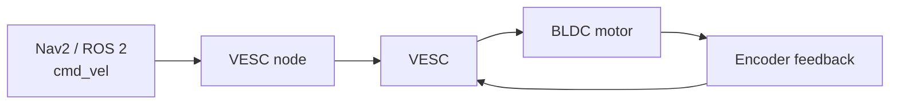

Κάνει:

ηλεκτρική οδήγηση του μοτέρ,
έλεγχο ρεύματος/ροπής,
έλεγχο ταχύτητας ή θέσης,
ανάγνωση Hall sensors/encoder,
ηλεκτρικό φρενάρισμα και regeneration,
αποστολή telemetry.

Με απλά λόγια:

Ο DWAL/Nav2 αποφασίζει πώς πρέπει να κινηθεί το robot. Ο VESC αναλαμβάνει να κάνει πραγματικά το μοτέρ να κινηθεί έτσι.


| Χαρακτηριστικό           |                                 Τιμή |
| ------------------------ | -----------------------------------: |
| Τάση εισόδου             |                              14–60 V |
| Μπαταρία                 |                   4S–12S συνιστώμενα |
| Ονομαστικό συνεχές ρεύμα |                             έως 70 A |
| Στιγμιαίο ρεύμα          |                            έως 200 A |
| Motor modes              |                        BLDC, DC, FOC |
| Interfaces               |             USB, UART, CAN, PPM, ADC |
| Sensors                  |    Hall, ABI encoder, AS5047/AS5048A |
| Έλεγχος                  | Current, duty cycle, speed, position |
| BEC                      |                            5 V / 1 A |
| Μέγεθος                  |            περίπου 67 × 39 × 18.7 mm |


---
## Theory
**shunt resistor**


A shunt resistor is usually a very small, accurately known resistor placed in series with the current path so that we can measure the current.


**hub motor**

Hub motor είναι motor ενσωματωμένος μέσα στην πλήμνη του τροχού.

Μπορεί να είναι:

Direct-drive hub motor.
Geared hub motor.

Στον direct-drive hub motor:

$$ RPM_{\text{motor}}=RPM_{\text{wheel}} $$

δηλαδή \(G=1\).


**PD tester**

USB Power Delivery tester

Μπαίνει ανάμεσα σε USB-C charger και συσκευή και μετρά:

Voltage.
Current.
Power.
Negotiated USB-PD profile.
Μερικές φορές ζητά συγκεκριμένη τάση μέσω PD trigger.
**Control modes velocity torque position duty cycle**
| Mode           | Τι στέλνει το Jetson | Πότε χρησιμοποιείται               |
| -------------- | -------------------: | ---------------------------------- |
| Velocity       |             RPM/ERPM | Τροχοφόρα mobile robots            |
| Torque/current |   Motor current σε A | Traction, force control, balancing |
| Position       |      Επιθυμητή γωνία | Servo joints και μηχανισμοί        |
| Duty cycle     |    Ποσοστό τάσης/PWM | Απλός open-loop-ish χειρισμός      |


**PWM**
PWM σημαίνει Pulse Width Modulation.

Ένα ψηφιακό σήμα ανοιγοκλείνει γρήγορα. Το ποσοστό του χρόνου που είναι ON λέγεται duty cycle:

$$ D=\frac{t_{\mathrm{ON}}}{T} $$

Υπάρχουν δύο διαφορετικά PWM στα drones:

Command PWM

Ο flight controller στέλνει στον ESC παλμούς που εκφράζουν throttle. Παραδοσιακά μπορεί να είναι περίπου 1–2 ms pulse width. Νεότερα συστήματα χρησιμοποιούν OneShot ή ψηφιακό DShot.

Motor-drive PWM

Ο ESC χρησιμοποιεί MOSFETs και υψηλής συχνότητας PWM για να εφαρμόσει ελεγχόμενες τάσεις στις τρεις φάσεις του BLDC motor.

Άρα:

$$ \text{Flight controller command} \rightarrow \text{ESC} \rightarrow \text{MOSFET phase PWM} \rightarrow \text{motor} $$

Στο robot με CAN δεν χρειάζεται να παράγει το Jetson PWM. Στέλνει SET_RPM μέσω CAN και το VESC παράγει μόνο του το πραγματικό motor PWM.


**Baud vs. Bit RateBaud Rate:**
Counts how many times a signal changes its state or transmits a symbol per second. A symbol is an individual state or pulse of a carrier signal.Bit Rate (bps): Counts the actual number of individual binary data bits (0s and 1s) transferred per second.The Formula: Bit Rate = Baud Rate × Number of bits per symbol

**ESC**

σημαίνει Electronic Speed Controller.

**RC system**

RC σημαίνει Radio Control και περιλαμβάνει:

Χειριστήριο/transmitter.
Ασύρματη RF σύνδεση.
Receiver πάνω στο όχημα.
Output από τον receiver προς τον ESC.

**PPM**

PPM σημαίνει Pulse Position Modulation.

Είναι ένας τρόπος με τον οποίο ο receiver μεταφέρει τις εντολές καναλιών προς τον controller/ESC. Δεν είναι το ασύρματο μέρος του συστήματος.

Άρα:

RC = ολόκληρο το σύστημα τηλεχειρισμού.
PPM = ένα πιθανό ηλεκτρικό format εξόδου του receiver.


## Ερωτήσεις


Εξηγησε αυτό

Ο incremental encoder παράγει παλμούς καθώς περιστρέφεται ο άξονας. Κάθε παλμός/edge αντιμετωπίζεται σαν ένα tick.

Αν ο συνολικός αριθμός είναι \(N\) counts ανά περιστροφή:

$$ \Delta\theta = 2\pi\frac{\Delta ticks}{N} $$

Η γωνιακή ταχύτητα είναι:

$$ \omega= \frac{\Delta\theta}{\Delta t} $$

Η απόσταση που διένυσε ο τροχός είναι:

$$ \Delta s=r\Delta\theta $$

“Integrating the encoder ticks” σημαίνει ότι προσθέτουμε διαδοχικά τις μικρές μεταβολές:

$$ ticks_{\text{total}} = ticks_{\text{total}}+\Delta ticks $$

Έτσι βρίσκουμε τη συνολική περιστροφή και την απόσταση, όχι μόνο την στιγμιαία ταχύτητα.

Για differential drive:

$$ \Delta s= \frac{\Delta s_R+\Delta s_L}{2} $$ $$ \Delta\theta_{\text{robot}} = \frac{\Delta s_R-\Delta s_L}{L} $$

Από αυτά υπολογίζεται το wheel odometry /odom.


-----------------

4. Γιατί χρησιμοποιούμε FOC

Για assistive mobile robot πιθανότατα θέλεις FOC — Field-Oriented Control.

Σε σύγκριση με απλό BLDC commutation προσφέρει συνήθως:

πιο ομαλή κίνηση,
λιγότερο θόρυβο,
καλύτερο έλεγχο ροπής,
καλύτερη συμπεριφορά σε μικρές ταχύτητες,
ομαλότερο ξεκίνημα και φρενάρισμα.


$I_{max} =min(I_{VESC} ,I_{motor},I_{battery},I_{BMS}, I_{wiring})$


----
120 Ohms in canbus

---
Τα παρακάτω είναι είδη encoders

| Sensor/interface     | Incremental ή absolute           | Χαρακτηριστικά                                                          |
| -------------------- | -------------------------------- | ----------------------------------------------------------------------- |
| ABI/quadrature       | Incremental                      | Απλό, γρήγορο, χάνει absolute θέση μετά την εκκίνηση                    |
| Hall sensors         | Συνήθως σχετική rotor position   | Χαμηλή ανάλυση, καλό startup                                            |
| SPI magnetic encoder | Absolute                         | Ψηφιακή γωνία, υψηλή ανάλυση                                            |
| SSI/BiSS-C           | Absolute                         | Βιομηχανικό serial encoder interface                                    |
| Sin/Cos encoder      | Incremental/absolute ανά σύστημα | Αναλογικά ημιτονοειδή σήματα                                            |
| Resolver             | Absolute rotor angle             | Πολύ ανθεκτικό, πιο σύνθετο interface                                   |
| Sensorless observer  | Χωρίς sensor                     | Υπολογίζει θέση από τάσεις/ρεύματα, δυσκολότερο σε πολύ χαμηλή ταχύτητα |


3. Κάνε motor detection με τους τροχούς σηκωμένους.

Το VESC CAN status μπορεί να επιστρέψει:

ERPM.
Motor current.
Duty cycle.
FET/motor temperature.
Input voltage.
Tachometer.

Το CAN_PACKET_STATUS_5 περιέχει cumulative tachometer σε electrical revolutions. Δεν είναι απαραίτητα τα ακατέργαστα ABI encoder ticks. VESC status-message format https://github.com/vedderb/bldc/blob/master/documentation/comm_can.md?utm_source=chatgpt.com

Για μετατροπή σε wheel revolutions χρειάζονται pole pairs και gear ratio:

$$ N_{\text{wheel rev}} = \frac{N_{\text{electrical rev}}} {pG} $$

Πρέπει να ελεγχθεί πειραματικά: σημείωσε την αρχική τιμή, κάνε τον τροχό ακριβώς μία περιστροφή και δες πόσο άλλαξε το tachometer.


